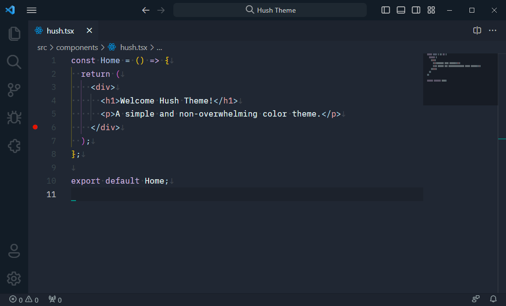

# Hush

A pale and non-overwhelming color theme. Based on **[Mirage](https://marketplace.visualstudio.com/items?itemName=tristanremy.mirage)** and **[Atom Material Theme](https://marketplace.visualstudio.com/items?itemName=tobiasalthoff.atom-material-theme)**.

Font family used: **[ia Writer Mono S](https://fontsource.org/fonts/ia-writer-mono)**  
Icon theme used: **[Material Icon Theme](https://marketplace.visualstudio.com/items?itemName=PKief.material-icon-theme)**  
Product icon theme used: **[Fluent Icons](https://marketplace.visualstudio.com/items?itemName=miguelsolorio.fluent-icons)**

  

